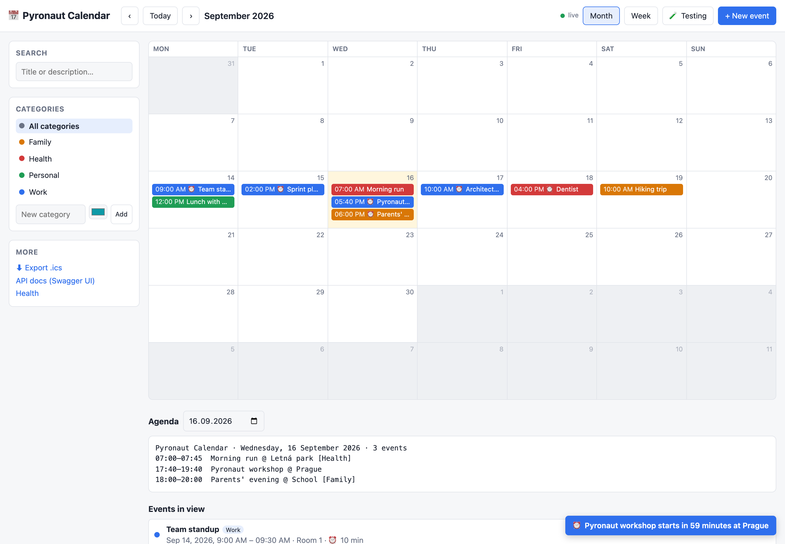
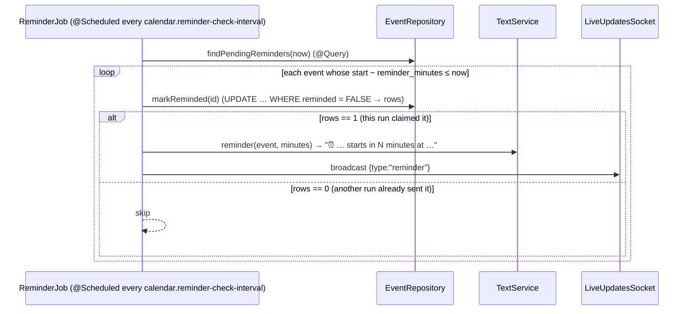

# Pyronaut Calendar

A calendar application written in **Python** and running on **Pyronaut**, which executes Python on GraalPy inside the Micronaut Framework. It's a small app that uses many parts of Micronaut:
- HTTP server;
- dependency injection;
- Serde and validation;
- Micronaut Data JDBC and Flyway;
- transactions and (transactional) application events;
- WebSocket;
- scheduling and caching;
- configuration;
- management endpoints and OpenAPI;
- Jakarta Expression Language.



Contents:
[Quick start](#quick-start) ·
[Architecture](#architecture) ·
[Micronaut features](#micronaut-features-used) ·
[Configuration](#configuration) ·
[HTTP API](#http-api) ·
[Testing menu](#testing-menu) ·
[Tests](#tests) ·
[Pyronaut notes](#pyronaut-notes-and-known-limitations)

---

## Quick start

```bash
graalpy -m venv .venv && source .venv/bin/activate && pip install pytest
pyronaut install      # resolves Maven dependencies, generates IDE stubs and the config schema
pyronaut run          # processes the sources and starts the app on http://localhost:8123
```

| URL | What |
|---|---|
| http://localhost:8123/ | Calendar UI |
| http://localhost:8123/swagger-ui/index.html | OpenAPI / Swagger UI |
| http://localhost:8123/health | Health endpoint (with details) |

Data is stored in an H2 database file under `./data/`. Delete that directory to start from scratch.

---

## Architecture

### Layers

```mermaid
flowchart LR
    subgraph Browser
        UI["index.html<br/>(static resource)"]
    end

    subgraph web["web/ – HTTP & WebSocket"]
        EC[EventController]
        CC[CategoryController]
        SC[SettingsController]
        TC[TestingController]
        WS[LiveUpdatesSocket]
        EH[ExceptionHandlers]
    end

    subgraph service["service/ – business logic"]
        ES[EventService<br/>@Transactional]
        CS[CategoryService<br/>@Transactional · @Cacheable]
        TS[TextService<br/>Jakarta EL]
        IS[ICalService]
        CN[ChangeNotifier<br/>@TransactionalEventListener]
        SEED[CategorySeeder<br/>StartupEvent]
    end

    subgraph jobs["jobs/"]
        RJ[ReminderJob<br/>@Scheduled]
    end

    subgraph repo["repository/ – Micronaut Data JDBC"]
        ER[EventRepository]
        CR[CategoryRepository]
    end

    DB[(H2<br/>Flyway schema)]

    UI -- "REST (JSON, text/calendar, text/plain)" --> EC & CC & SC & TC
    UI <-. "WebSocket /ws/events" .-> WS
    EC --> ES & IS & TS
    CC --> CS
    TC --> ES & RJ & WS & TS
    ES & CS --> ER & CR
    ES & CS -- "publishEvent(EventChange)" --> CN
    CN --> TS
    CN --> WS
    RJ --> ER
    RJ --> TS
    RJ --> WS
    SEED --> CS
    ER & CR --> DB
```

### Source layout

All application code is in [`src/calendarapp`](src/calendarapp). Pyronaut generates the package `__init__.py` files, so don't add your own (see [notes](#pyronaut-notes-and-known-limitations)).

| Package | Files | Responsibility |
|---|---|---|
| `domain/` | [`event.py`](src/calendarapp/domain/event.py), [`category.py`](src/calendarapp/domain/category.py), [`event_change.py`](src/calendarapp/domain/event_change.py), [`errors.py`](src/calendarapp/domain/errors.py) | Entities (`@MappedEntity`), the `EventChange` application event, exception types |
| `repository/` | [`event_repository.py`](src/calendarapp/repository/event_repository.py), [`category_repository.py`](src/calendarapp/repository/category_repository.py) | Micronaut Data JDBC repositories, generated at build time |
| `service/` | [`event_service.py`](src/calendarapp/service/event_service.py), [`category_service.py`](src/calendarapp/service/category_service.py), [`change_notifier.py`](src/calendarapp/service/change_notifier.py), [`category_seeder.py`](src/calendarapp/service/category_seeder.py), [`text_service.py`](src/calendarapp/service/text_service.py), [`ical_service.py`](src/calendarapp/service/ical_service.py) | Transactions, events, caching, text generation, iCalendar rendering |
| `jobs/` | [`reminder_job.py`](src/calendarapp/jobs/reminder_job.py) | Scheduled reminder job |
| `web/` | [`event_controller.py`](src/calendarapp/web/event_controller.py), [`category_controller.py`](src/calendarapp/web/category_controller.py), [`settings_controller.py`](src/calendarapp/web/settings_controller.py), [`testing_controller.py`](src/calendarapp/web/testing_controller.py), [`live_updates_socket.py`](src/calendarapp/web/live_updates_socket.py), [`errors.py`](src/calendarapp/web/errors.py) | HTTP controllers, WebSocket endpoint, exception handlers |
| `config/` | [`calendar_configuration.py`](src/calendarapp/config/calendar_configuration.py) | `@ConfigurationProperties` beans |
| (root) | [`api_definition.py`](src/calendarapp/api_definition.py) | OpenAPI metadata |

Resources are in [`config/`](config), which Pyronaut puts on the classpath:
- [`application.toml`](config/application.toml): configuration;
- [`application-e2e.toml`](config/application-e2e.toml): the `e2e` environment;
- [`db/migration/`](config/db/migration): Flyway scripts;
- [`public/index.html`](config/public/index.html): the UI.

Imports only go one way, `web → service → repository → domain`, with `config` usable from everywhere. This matters in Pyronaut because the generated package `__init__` files import every module in a package, so an import cycle between packages breaks at startup.

### Request flow: creating an event

```mermaid
sequenceDiagram
    autonumber
    participant B as Browser
    participant C as EventController
    participant V as Validation / Serde
    participant S as EventService (@Transactional)
    participant R as EventRepository
    participant P as ApplicationEventPublisher
    participant N as ChangeNotifier (@TransactionalEventListener)
    participant T as TextService (Jakarta EL)
    participant W as LiveUpdatesSocket

    B->>C: POST /api/events {title, start, end, category:{id}, reminder_minutes}
    C->>V: @Body @Valid Event (Serde deserializes, Bean Validation checks)
    V-->>B: 400 on constraint violations
    C->>S: create(event)
    S->>S: business rules (end ≥ start, category exists)
    S-->>B: InvalidRequestException → 400 (ExceptionHandler)
    S->>R: save(event)  (INSERT; @DateCreated, @Version set)
    S->>P: publishEvent(EventChange("created", id, title))
    Note over P,N: the listener is deferred until the transaction commits
    S->>R: getById(id)  (@Join category)
    S-->>C: saved event
    C-->>B: 201 Created + Location
    P->>N: on_change(EventChange) (after commit)
    N->>T: change("created", title) → "Added “…”"
    N->>W: broadcast JSON
    W-->>B: {type:"created", message:"Added “…”"} (every open tab)
```

### Reminder flow



The conditional `UPDATE` makes the job safe when two runs overlap (the scheduled run plus a manual run from the testing menu): only the run that flips the flag sends the reminder.

---

## Micronaut features used

### HTTP server and routing

- **Controllers:** classes annotated with `@Controller("/api/...")`, with `@Get`, `@Post`, `@Put` and `@Delete` methods ([`event_controller.py`](src/calendarapp/web/event_controller.py)).
- **Blocking work:** `@ExecuteOn(TaskExecutors.BLOCKING)` on a controller runs its JDBC-bound handlers off the Netty event loop.
- **Parameter binding:**
  - path variables (`/{id}`);
  - query values with explicit names, e.g. `QueryValue("from")` on a Python parameter called `from_`;
  - `@Body` payloads;
  - `Pageable` (from `?page=&size=&sort=`).
- **Content negotiation:** most endpoints return JSON. `export.ics` produces `text/calendar` with a `Content-Disposition` header, and `agenda` produces `text/plain`.
- **Responses:** `HttpResponse.created(...)` with a `Location` header, and `@Status(HttpStatus.NO_CONTENT)` for deletes.
- **Static resources:** `micronaut.router.static-resources` serves the UI from `classpath:public` and Swagger UI from `classpath:META-INF/swagger/views/swagger-ui`.

```python
@Controller("/api/events")
@ExecuteOn(TaskExecutors.BLOCKING)
class EventController:
    @Get(value="/export.ics", produces="text/calendar")
    def export(self) -> HttpResponse[str]: ...
```

### Dependency injection

- **Beans:** `@Singleton` classes with **constructor injection** based on type hints (`def __init__(self, events: EventService, ...)`).
- **Event listeners:**
  - a `@Singleton` implementing `ApplicationEventListener[StartupEvent]` ([`category_seeder.py`](src/calendarapp/service/category_seeder.py));
  - a method annotated with `@TransactionalEventListener` ([`change_notifier.py`](src/calendarapp/service/change_notifier.py)).
- **Conditional beans:** `@Requires(property="calendar.testing.enabled", value="true")` means `TestingController` only exists when the flag is on ([`testing_controller.py`](src/calendarapp/web/testing_controller.py)).
- **Framework beans used directly:** `BeanContext`, `ApplicationEventPublisher`, `CacheManager` and `WebSocketBroadcaster` are injected like any other bean.

### Serialization (Micronaut Serde)

Every type that crosses the HTTP boundary is a Python `@dataclass` annotated with `@Serdeable`: `Event`, `Category`, `EventChange`, `Broadcast` and the configuration beans. Serde generates the (de)serializers at build time from the class introspection, so no runtime reflection is involved.

- **Field names:** JSON uses the Python field names as-is (`reminder_minutes`, `created_at`).
- **Null values:** they are left out of the JSON. For example, an event without a category has no `category` key.
- **Nested objects:** the UI sends `{"category": {"id": 3}}`, and the service resolves the full category.
- **Dates:** `datetime` fields are serialized as ISO-8601 local date-times (`2026-09-16T09:00:00`).
- **Pages:** Micronaut Data `Page` values serialize as `{content, pageable:{number,size,sort}, totalSize}`.

### Bean Validation

- **Constraints:** declared with `typing.Annotated` on the entity fields:
  - `NotBlank` and `Size(max=200)` on `title`;
  - `Min(0)` and `Max(10080)` on `reminder_minutes`;
  - `Pattern("^#[0-9a-fA-F]{6}$")` on the category colour.
- **Trigger:** request bodies are validated with `Annotated[Event, Body, Valid]`. A violation produces a `400` with Micronaut's standard JSON error body.
- **Business rules:** rules that involve several fields or the database, such as "end ≥ start" or "the category exists", are checked in the service and raise `InvalidRequestException`.

```python
@dataclass
@Serdeable
@MappedEntity("calendar_event")
class Event:
    id: Annotated[int | None, Id, GeneratedValue] = None
    version: Annotated[int | None, Version] = None
    title: Annotated[str | None, NotBlank, Size(max=200)] = None
    start: Annotated[datetime | None, NotNull, MappedProperty("start_time")] = None
    ...
    category: Annotated[Category | None, Relation(value=Relation.Kind.MANY_TO_ONE)] = None
    created_at: Annotated[datetime | None, DateCreated] = None
```

### Data access (Micronaut Data JDBC)

The repositories are Python classes whose method bodies are `...`. Micronaut Data's annotation processor implements them at **build time**, so no SQL is built at runtime.

| Feature | Where / example |
|---|---|
| Entity mapping, custom table and column names | `@MappedEntity("calendar_event")`, `MappedProperty("start_time")`. `start` and `end` are reserved words in SQL. |
| Generated IDs | `Id, GeneratedValue` |
| Optimistic locking | `@Version`: every update increments `version` and fails on a stale version |
| Auditing | `@DateCreated`, `@DateUpdated` |
| Many-to-one relation | `Relation(Relation.Kind.MANY_TO_ONE)` → `category_id` foreign key |
| Fetch joins | `@Join(value="category", type=Join.Type.LEFT_FETCH)` on the finders, so events come back with their category in one query |
| Derived queries | `findByStartLessThanAndEndGreaterThanOrderByStart`, `findByCategoryIdAndStartLessThan…`, `findByTitleIlikeOrDescriptionIlike`, `findFirstByStartGreaterThanEqualsOrderByStart`, `existsByName`, `listOrderByName` |
| Pagination | `findByTitleIlikeOrDescriptionIlike(…, pageable: Pageable) -> Page[Event]` |
| Explicit SQL | `@Query("UPDATE calendar_event SET reminded = TRUE WHERE id = :id AND reminded = FALSE")`, which returns the number of affected rows |
| `CrudRepository` | `save`, `update`, `findById`, `existsById`, `deleteById`, `deleteAll`, `count` |

See [`event_repository.py`](src/calendarapp/repository/event_repository.py).

Python fields are snake_case (`reminder_minutes`). Derived query names can't refer to them (`ReminderMinutes` doesn't resolve), so those queries use `@Query`. Named query parameters also can't contain underscores (`:categoryId`, not `:category_id`).

### Database migrations (Flyway)

- **Schema source:** `micronaut-flyway` runs [`V1__create_calendar.sql`](config/db/migration/V1__create_calendar.sql) when the data source starts (`flyway.datasources.default.enabled = true`). Schema generation by Micronaut Data is off.
- **Tests:** the same migration runs against the in-memory database used by the tests.

### Transactions

- **Where:** service methods that write are annotated with `@Transactional` (`jakarta.transaction`), in [`event_service.py`](src/calendarapp/service/event_service.py) and [`category_service.py`](src/calendarapp/service/category_service.py).
- **Update pattern:** `EventService.update` loads the entity, copies the editable fields onto it, checks business rules and calls `update`, all in one transaction. The server-managed fields (`version`, `created_at`, `reminded`) therefore can't be overwritten by the client.
- **Category delete:** detaches the events (`UPDATE … SET category_id = NULL`) and deletes the category in the same transaction.

### Application events and transactional events

`EventChange` is a plain `@Serdeable` dataclass used as an **application event**. Services publish it through the injected `ApplicationEventPublisher` whenever an event or category changes:

```python
self.publisher.publishEvent(EventChange("created", saved.id, saved.title))
```

[`ChangeNotifier`](src/calendarapp/service/change_notifier.py) receives it with **`@TransactionalEventListener`**. Its default phase is `AFTER_COMMIT`, so the listener runs only once the data is committed:

```python
@Singleton
class ChangeNotifier:
    @TransactionalEventListener
    def on_change(self, change: EventChange) -> None:
        if change.type.startswith("category-"):
            self.cache_manager.getCache("categories").invalidateAll()
        message = self.texts.change(change.type, change.title)
        self.socket.send({"type": change.type, "id": change.id, "message": message})
```

Why it has to run after commit:
- **Browser refresh:** the WebSocket message makes every browser re-fetch data. Sent before commit, the browsers could read the old state.
- **Cache refresh:** `@CacheInvalidate` only runs when the service method returns. The listener clears the categories cache first, so a client that reacts to the message never re-caches the old list.
- **Rollbacks:** a rolled-back change never produces a notification.

A second kind of event listener is [`CategorySeeder`](src/calendarapp/service/category_seeder.py): it implements `ApplicationEventListener[StartupEvent]` and creates the categories listed in `calendar.default-categories` when the table is empty.

### Caching (Micronaut Cache + Caffeine)

- **Cached method:** `CategoryService.all()` is annotated with `@Cacheable`, inside `@CacheConfig("categories")`.
- **Invalidation:** `create` and `delete` are annotated with `@CacheInvalidate(all=True)`, and `ChangeNotifier` also clears the cache through `CacheManager` (see above).
- **Settings:** the cache is configured in `[micronaut.caches.categories]` (`maximum-size`, `expire-after-write`).

### WebSocket

- **Endpoint:** [`LiveUpdatesSocket`](src/calendarapp/web/live_updates_socket.py) is a `@ServerWebSocket("/ws/events")` with `@OnOpen()`, `@OnMessage` and `@OnClose()` handlers.
- **Sending:** it pushes JSON to every connected session through the injected `WebSocketBroadcaster`.
- **Message types:**
  - `created`, `updated`, `deleted` and `cleared`;
  - `category-created` and `category-deleted`;
  - `reminder`;
  - `notice` (from the testing menu's broadcast).
- **Client side:** the UI shows a toast, refreshes its data, and reconnects automatically. The header shows a "live" indicator while the connection is open.

### Scheduling

- **Job:** [`ReminderJob.send_due_reminders`](src/calendarapp/jobs/reminder_job.py) is annotated with `@Scheduled(fixedDelay="${calendar.reminder-check-interval:30s}", initialDelay="5s")`, so the interval is a **property placeholder** with a default.
- **Per environment:** the tests set the interval to 1 s and the e2e environment to 2 s.
- **Overlapping runs:** a manual run (testing menu) and a scheduled run can overlap, so reminders are claimed with a conditional update (see the [reminder flow](#reminder-flow)).

### Configuration

Three `@ConfigurationProperties` beans are declared in [`calendar_configuration.py`](src/calendarapp/config/calendar_configuration.py). Keys in `application.toml` are kebab-case and bind to snake_case Python fields (`default-duration-minutes` → `default_duration_minutes`).

| Bean | Prefix | Used by |
|---|---|---|
| `CalendarConfiguration` | `calendar` | name, default duration and reminder (UI), default categories (seeder), reminder interval (job) |
| `TemplatesConfiguration` | `calendar.templates` | Jakarta EL templates for the agenda and iCalendar descriptions |
| `TestingConfiguration` | `calendar.testing` | `@Requires` on `TestingController`, and whether the UI shows the Testing menu |

Environments:
- **`test`:** used by `pyronaut test`, configured in [`tests-config/application-test.toml`](tests-config/application-test.toml);
- **`e2e`:** used by the Playwright tests, configured in [`config/application-e2e.toml`](config/application-e2e.toml). It sets a random port (`port = -1`) and an in-memory database.

`pyronaut install` generates a JSON schema from the configuration beans, which gives completion in `application.toml`. Pyronaut also validates the configuration against that schema before `run` and `test`.

### Error handling

- **Exception types:** `NotFoundException` and `InvalidRequestException` ([`domain/errors.py`](src/calendarapp/domain/errors.py)) are Python subclasses of `java.lang.RuntimeException`.
- **Handlers:** two `ExceptionHandler[...]` beans in [`web/errors.py`](src/calendarapp/web/errors.py) turn them into `404` and `400` responses with the same JSON shape as Micronaut's built-in errors (`{"message": …, "_embedded": {"errors": [...]}}`).
- **Everything else:** validation failures (`400`) and unknown routes (`404`) use Micronaut's default handling.

### Management endpoints

`micronaut-management` provides `/health`, `/info` and `/beans`, among others. Health details are visible anonymously (`endpoints.health.details-visible = "ANONYMOUS"`) and include the JDBC data source and disk space.

### OpenAPI and Swagger UI

- **Spec generation:** `micronaut-openapi` runs as an annotation processor. It generates `META-INF/swagger/calendar-0.1.0.yml` from the controllers, and Python docstrings become the operation descriptions.
- **Metadata:** title, version and description come from `@OpenAPIDefinition` in [`api_definition.py`](src/calendarapp/api_definition.py).
- **UI:** Swagger UI is generated alongside the spec and served at `/swagger-ui/index.html`.

### Text generation with Jakarta EL

[micronaut-jakarta-el](https://github.com/micronaut-projects/micronaut-jakarta-el) is an implementation of Jakarta Expression Language 6.0. [`TextService`](src/calendarapp/service/text_service.py) uses it for all generated text:

| Text | Expression source |
|---|---|
| Reminders: `⏰ Standup starts in 5 minutes at Room 1` | constant `REMINDER` in `text_service.py` |
| Change notices: `Added “…”`, `Deleted category “…”`, `Calendar cleared: 8 events` | constant `CHANGE` in `text_service.py` |
| Agenda header and lines (`/api/events/agenda`) | `calendar.templates.agenda-header` / `agenda-line` in `application.toml` |
| iCalendar `DESCRIPTION` | `calendar.templates.ical-description` |

```toml
[calendar.templates]
agenda-line = "#{event.multiDay ? '(multi-day)  ' : event.start += '–' += event.end += '  '}#{event.title}#{empty event.location ? '' : ' @ ' += event.location}"
```

- **Parsing:** expressions are parsed by `micronaut-jakarta-el-interpreter` the first time they are used, and evaluated against a `CompiledELContext(beanContext)`.
- **Variables:** plain `java.util.Map` objects (`event`, `change`, `count`, `day`…).
- **Syntax used:** the operators `+=` (string concatenation), `empty`, `== / ?:`, and nested conditionals.
- **Template syntax:** templates in configuration use the deferred **`#{…}`** syntax. Micronaut would treat `${…}` in a configuration value as a property placeholder.

---

## Configuration

| Key | Default | Meaning |
|---|---|---|
| `micronaut.server.port` | `8123` | HTTP port |
| `datasources.default.url` | `jdbc:h2:file:./data/calendar` | Database |
| `calendar.name` | `Pyronaut Calendar` | Shown in the UI and the agenda |
| `calendar.default-duration-minutes` | `60` | Length of new events in the UI |
| `calendar.default-reminder-minutes` | `15` | Preselected reminder in the UI |
| `calendar.default-categories` | Work, Personal, Family, Health | Created on first start |
| `calendar.reminder-check-interval` | `30s` | Reminder job interval |
| `calendar.templates.*` | see `application.toml` | Jakarta EL templates |
| `calendar.testing.enabled` | `true` | Testing endpoints and menu. **Set to `false` in production.** |
| `micronaut.caches.categories.*` | size 100, 10 min | Category cache |

---

## HTTP API

| Method | Path | Description |
|---|---|---|
| GET | `/api/events?from=&to=&category=` | Events overlapping `[from, to)`, optionally only one category. Without a range, all events. |
| GET | `/api/events/search?q=&page=&size=&sort=` | Case-insensitive search over title and description, paginated |
| GET | `/api/events/agenda?day=YYYY-MM-DD` | Plain-text agenda (Jakarta EL templates) |
| GET | `/api/events/export.ics` | All events as iCalendar (`VEVENT` + `VALARM`) |
| GET | `/api/events/{id}` | One event, or `404` |
| POST | `/api/events` | Create an event → `201` |
| PUT | `/api/events/{id}` | Update an event, or `404` |
| DELETE | `/api/events/{id}` | Delete an event → `204`, or `404` |
| GET / POST | `/api/categories` | List (cached) / create (`400` for a duplicate name or a bad colour) |
| DELETE | `/api/categories/{id}` | Delete a category; its events keep existing without one |
| GET | `/api/settings` | UI settings from the configuration beans |
| WS | `/ws/events` | Live notifications |
| POST | `/api/testing/random-event`, `/sample-events`, `/reminder`, `/run-reminders`, `/reset-reminders`, `/broadcast` | Testing helpers (only with `calendar.testing.enabled`) |
| DELETE | `/api/testing/events` | Delete all events (testing helper) |

The full specification is in Swagger UI.

---

## Testing menu

With `calendar.testing.enabled = true`, the header shows **🧪 Testing**:

| Action | Effect |
|---|---|
| Add a random event | Creates one random event (title, time, category, location, reminder) on a day of the current month |
| Add sample week of events | Creates 8 fixed events across the current week |
| Show a reminder for the next event | Pushes the reminder text for the next upcoming event, or for an unsaved sample event. **Nothing is saved or marked as reminded.** |
| Run reminder job | Runs `ReminderJob` now and reports how many reminders it sent |
| Reset reminder flags | Marks every event as not reminded, so due reminders fire again |
| Broadcast a notification… | Pushes a custom message to every open tab |
| Delete all events | Deletes every event (after you confirm); categories are kept |

---

## Tests

### Application tests (`pyronaut test`)

Pytest tests in [`tests/`](tests) run on GraalPy against a started application context, using the `test` environment with an in-memory database:

```bash
pyronaut test
```

They cover:
- creating, reading, updating and deleting events, including version increments and timestamps;
- validation and error responses;
- categories and the cache;
- paginated search;
- EL-rendered agenda text;
- the iCalendar export;
- settings and health;
- the OpenAPI spec and static UI;
- the scheduled reminder job;
- the testing endpoints, both enabled and disabled via `@Requires`.

After changing a `@ConfigurationProperties` class, run `pyronaut process` first. Configuration validation runs before processing and would otherwise check against the old schema.

### Browser tests (Playwright)

End-to-end tests in [`e2e/`](e2e) use Playwright with **CPython**, because Playwright's driver can't run on the embedded GraalPy:

```bash
python3.12 -m venv .venv-e2e && .venv-e2e/bin/pip install -r e2e/requirements.txt
cd e2e && ../.venv-e2e/bin/pytest
```

- **Isolated app:** [`conftest.py`](e2e/conftest.py) starts `pyronaut run` with `MICRONAUT_ENVIRONMENTS=e2e`, reads the random port from the "Server Running" log line, and stops the app afterwards.
- **Browser:** tests use the installed Google Chrome (`--browser-channel chrome` in [`pytest.ini`](e2e/pytest.ini)).
- **Existing instance:** add `--base-url http://localhost:8123` to test an app that's already running.
- **Watch the browser:** add `--headed --slowmo 300`.
- **Coverage:**
  - [`test_calendar_ui.py`](e2e/test_calendar_ui.py) covers:
    - creating, editing and deleting events, with dialog defaults and validation;
    - categories and filtering;
    - search pagination and the week view;
    - updates from another client arriving live;
    - reminders;
    - the `.ics` download and Swagger UI.
  - [`test_testing_menu.py`](e2e/test_testing_menu.py) covers every Testing menu action.

### Screenshot

`docs/screenshot.png` is generated by [`e2e/take_screenshot.py`](e2e/take_screenshot.py), which starts a throw-away app, adds sample data and captures the page:

```bash
cd e2e && ../.venv-e2e/bin/python take_screenshot.py
```

---

## Pyronaut notes and known limitations

- **No hand-written `__init__.py`:** Pyronaut generates the package `__init__` files for the GraalPy virtual file system and rejects your own. The generated files import every module in the package, so keep imports between packages one-directional (this is why the exception types are in `domain/`, not `web/`).
- **Toolchain is `jvm`:** under the `native` toolchain, Micronaut Flyway aborts the process. It calls `ImageSingletons.contains`, which isn't compiled into Pyronaut's prebuilt native runtime.
- **Jakarta EL is interpreted, not compiled:** `@ELExpression` with `micronaut-jakarta-el-processor` fails under Pyronaut 0.0.3. The processor tool puts its own micronaut-sourcegen 2.1.0 first on the classpath, and the EL processor can't load `ByteCodeGenerator`. The interpreter works fine.
- **Endpoints that are off by default** (`/flyway`, `/caches`) stay `404` even after enabling them in configuration. The endpoints that are on by default work.
- **Python subclasses of Java exceptions:** Java code receives the Java side of the object. Python attributes are reached through `this` (see `web/errors.py`).
- **`None` from Java:** values that went through Java can arrive as `ForeignNone`, which `json.dumps` rejects. `LiveUpdatesSocket` normalises them.
- **`MICRONAUT_ENVIRONMENTS` needs a suppression:** the generated configuration schema doesn't include it, so it's listed under `[tool.pyronaut.validation] suppressions` in `pyproject.toml`.
- **IDE stubs:** `pyronaut install` writes stubs to `__pyronaut__/ide-stubs`. Mark that directory as a source root in PyCharm (Settings → Project Structure → Sources). Using `@OnOpen()` / `@OnClose()` with parentheses avoids a false "lacks a positional argument" warning.
